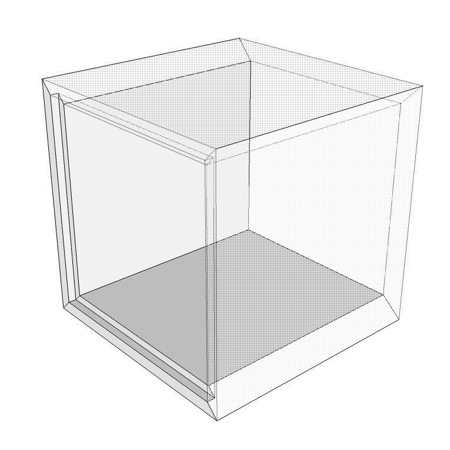

# Boxes Calculator

* Berekent de stukkenlijst om kubussen in hout aan te maken.
 * 2 zijkanten 
 * 2 bovenkanten
 * 1 achterkant
* Maakt een zaagplan op met zo min mogelijk verlies (basis implementatie van een shelving algorihme)
* Achterkanten staan apart opgelijst omdat deze uit andere panelen komen (minder dik = goedkoper)

## React
This project was bootstrapped with [Create React App](https://github.com/facebookincubator/create-react-app).

Below you will find some information on how to perform common tasks. 
You can find the most recent version of this guide [here](https://github.com/facebookincubator/create-react-app/blob/master/packages/react-scripts/template/README.md).

